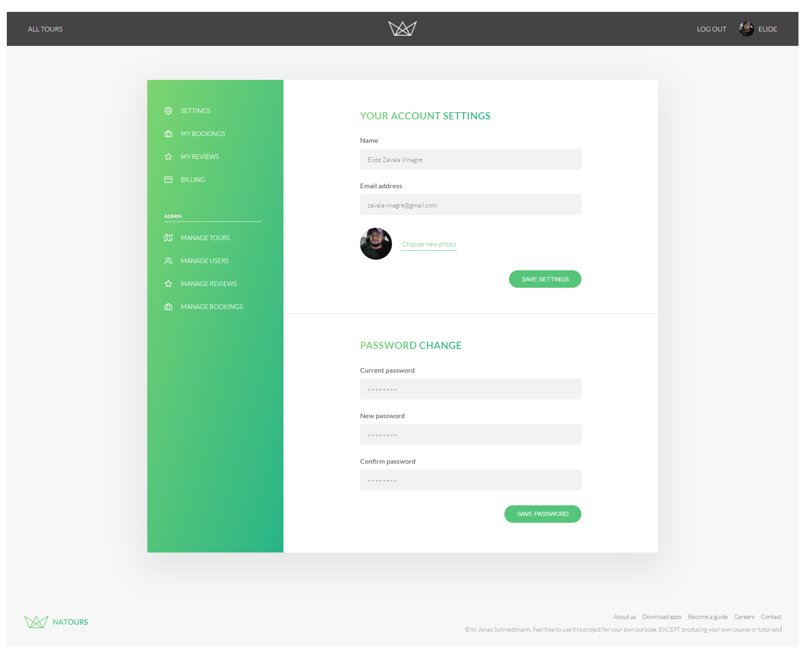

<h1 align="center">
  <a href="https://tourswebsiteusa.herokuapp.com/"></a>
  <br>
  Natours Application
  <br>
</h1>

<h3 align="center">Built using modern technologies: node.js, express. mongoDB, mongoose and friends.</h3>
<h4 align="center"><a href="https://nodejs.org/en/" target="_blank">NodeJS</a>.</h4>

<h2 align="center" fontWeightBold="900"> Website </h2>

<h4 align="center"><a  href="https://tourswebsiteusa.herokuapp.com/" target="_blank">💻👉Natours 👈💻</a></h3>

### All Tours

### Tour


### Setting User 


### Login 
 

### Reserve Tour
* Login to the site
* Search for tours that you want to book
* Book a tour
* Proceed to the payment checkout page
* Enter the card details (Test Mood):
```
  + Card Num: 4242 4242 4242 4242
  + Expiry date:  01 / 32
  + CVV: 108
```
* Finished!

## API Usage
Before using the API, you need to set the variables in Postman depending on your environment (development or production). Simply add: 
  ```
  - {{URL}} with your hostname as value (Eg. http://127.0.0.1:3000 or http://www.example.com)
  ```

Check [Natours API Documentation](https://documenter.getpostman.com/view/13422360/UVsJw6nC) for more info.

<b> API Features: </b>

Tours List 👉 https://tourswebsiteusa.herokuapp.com/api/v1/tours


Tours State 👉 https://tourswebsiteusa.herokuapp.com/api/v1/tours/tour-stats

Get Top 5 Cheap Tours 👉 https://tourswebsiteusa.herokuapp.com/api/v1/tours/top-5-cheap

Get Tours Within Radius 👉 https://tourswebsiteusa.herokuapp.com/api/v1/tours/tours-within/200/center/34.1117545,-118.113491/unit/mi

## Deployment
The website is deployed with git into heroku. Below are the steps taken:
```
git init
git add -A
git commit -m "Commit message"
heroku login
heroku create
heroku config:set CONFIG_KEY=CONFIG_VALUE
git push heroku master
heroku open
```

## Build With

* [NodeJS](https://nodejs.org/en/) - JS runtime environment
* [Express](http://expressjs.com/) - The web framework used
* [Mongoose](https://mongoosejs.com/) - Object Data Modelling (ODM) library
* [MongoDB Atlas](https://www.mongodb.com/cloud/atlas) - Cloud database service
* [Pug](https://pugjs.org/api/getting-started.html) - High performance template engine
* [JSON Web Token](https://jwt.io/) - Security token
* [ParcelJS](https://parceljs.org/) - Blazing fast, zero configuration web application bundler
* [Stripe](https://stripe.com/) - Online payment API
* [Postman](https://www.getpostman.com/) - API testing
* [Mailtrap](https://mailtrap.io/) & [Sendgrid](https://sendgrid.com/) - Email delivery platform
* [Heroku](https://www.heroku.com/) - Cloud platform


## Installation
You can fork the app or you can git-clone the app into your local machine. Once done that, please install all the
dependencies by running.
```
$ npm i
set your env variables
$ npm run watch:js
$ npm run build:js
$ npm run dev (for development)
$ npm run start:prod (for production)
$ npm run debug (for debug)
$ npm start
```
## About Bugs
This project is the still in modification, repair and improvement, if you want to help me, you can send me a message to the email mahamud15-10467@diu.edu.bd. Thank you!
## Acknowledgement

**This project is part of the online course I've taken at Udemy. Thanks to Jonas Schmedtmann for creating this course! Link to the course: [Node.js, Express, MongoDB & More: The Complete Bootcamp 2022](https://www.udemy.com/course/nodejs-express-mongodb-bootcamp/)**
